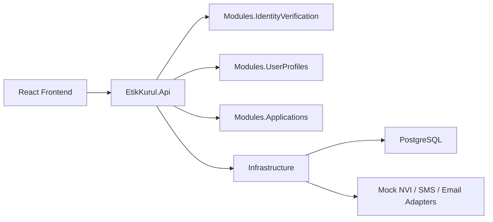

# Architecture Notes

Bu dokuman mevcut kod tabaninin mimari kararlarini ozetler.

## Mimari Stil

Uygulama modular monolith olarak gelistirilmektedir. Tek deployment birimi vardir, fakat domain sorumluluklari modul klasorleri ile ayrilmistir.

## Cozum Yapisi

| Klasor | Sorumluluk |
| --- | --- |
| `backend/src/EtikKurul.Api` | Controller, DTO, JWT, authorization policy, HTTP host |
| `backend/src/EtikKurul.Modules.IdentityVerification` | Kayit, login, NVI dogrulama, contact code servisleri |
| `backend/src/EtikKurul.Modules.UserProfiles` | Profil olusturma/guncelleme ve completion hesabi |
| `backend/src/EtikKurul.Modules.Applications` | Basvuru hazirlik, submit, uzman, sekreterya ve kurul akislari |
| `backend/src/EtikKurul.Infrastructure` | EF Core, entity mapping, seed data, encryption, mock adapterlar |
| `frontend/src` | React UI, API client ve demo workflow orchestration |
| `scripts` | Smoke test ve yardimci komutlar |

## Veri Guvenligi

| Konu | Karar |
| --- | --- |
| TCKN | Plain text saklanmaz, application-level encryption uygulanir |
| Dogum tarihi | Plain text saklanmaz, application-level encryption uygulanir |
| Identity check sonucu | Maskeli JSON ve request hash saklanir |
| Kodlar | Verification code hash olarak saklanir |
| JWT | Login sonrasi access token uretilir |

## Adapter Katmani

Dis servisler dogrudan domain servislerine gomulmez. Mevcut implementasyonda asagidaki kontratlar mock providerlarla calisir.

| Adapter | Amac | Mevcut implementasyon |
| --- | --- | --- |
| `IIdentityVerificationProvider` | NVI kimlik dogrulama | Mock provider |
| `ISmsProvider` | SMS kod gonderimi | Mock provider |
| `IEmailProvider` | Email kod gonderimi | Mock provider |

Gercek NVI, SMS veya email entegrasyonu eklendiginde controller ve domain servisleri degismeden DI kaydi degistirilmelidir.

## Ana Veri Tablolari

| Tablo | Modul | Amac |
| --- | --- | --- |
| `users` | IdentityVerification | Kullanici temel hesap verisi |
| `user_verification_codes` | IdentityVerification | Email/SMS tek kullanimlik kodlar |
| `user_identity_checks` | IdentityVerification | NVI kontrol audit kaydi |
| `roles` | IdentityVerification | Seed roller |
| `user_roles` | IdentityVerification | Kullanici rol iliskisi |
| `user_profiles` | UserProfiles | Profil ve completion bilgisi |
| `applications` | Applications | Basvuru ana kaydi |
| `application_parties` | Applications | Basvuru sahibi/ilgili kisi rolleri |
| `application_routing_assessments` | Applications | Intake routing sonucu |
| `application_forms` | Applications | Form verisi ve completion |
| `application_documents` | Applications | Dokuman metadata kaydi |
| `application_validation_checklist_items` | Applications | Sistem kontrol maddeleri |
| `application_expert_assignments` | Applications | Uzman atama |
| `application_expert_review_decisions` | Applications | Uzman revizyon/onay kararlari |
| `application_revision_responses` | Applications | Uzman revizyonuna arastirmaci yaniti |
| `application_review_packages` | Applications | Sekreterya inceleme paketi |
| `application_committee_agenda_items` | Applications | Kurul gundem maddesi |
| `application_committee_decisions` | Applications | Kurul revizyon/onay/red kararlari |
| `application_committee_revision_responses` | Applications | Kurul revizyonuna arastirmaci yaniti |

## Docker Topolojisi

| Service | Container rolu | Host port |
| --- | --- | --- |
| `frontend` | Nginx ile React static build ve `/api` proxy | `3006` |
| `api` | .NET 10 Web API | `8086` |
| `postgres` | PostgreSQL 17 | `5436` |

Not: Docker Desktop restart gerektirmez. Bu proje icin yalnizca repo kokundeki `docker compose up -d --build` kullanilir.

## Test Yaklasimi

| Test | Komut veya arac | Kapsam |
| --- | --- | --- |
| Frontend build | `npm run build` | TypeScript ve Vite build |
| Docker smoke | `powershell -ExecutionPolicy Bypass -File .\scripts\smoke-phase1.ps1` | Register'dan kurul onayina kadar uctan uca API/proxy akisi |
| Browser smoke | In-app browser | Auth Gateway, kayit, NVI paneline gecis ve UI sinyalleri |

## Kapsam Disi veya Sonraki Faz

| Konu | Not |
| --- | --- |
| Canli NVI/SMS/Email | Adapter kontratlari hazir, canli entegrasyon yok |
| EBYS / dis kurum entegrasyonu | Bu fazda yok |
| Dokuman upload storage | `cvDocumentId` nullable Guid, dosya yukleme modulu yok |
| Ayrik routing sayfalari | UI su an tek sayfa uygulamadir |
| Admin paneli | Roller seed edilir, admin UI/policy henuz yok |

