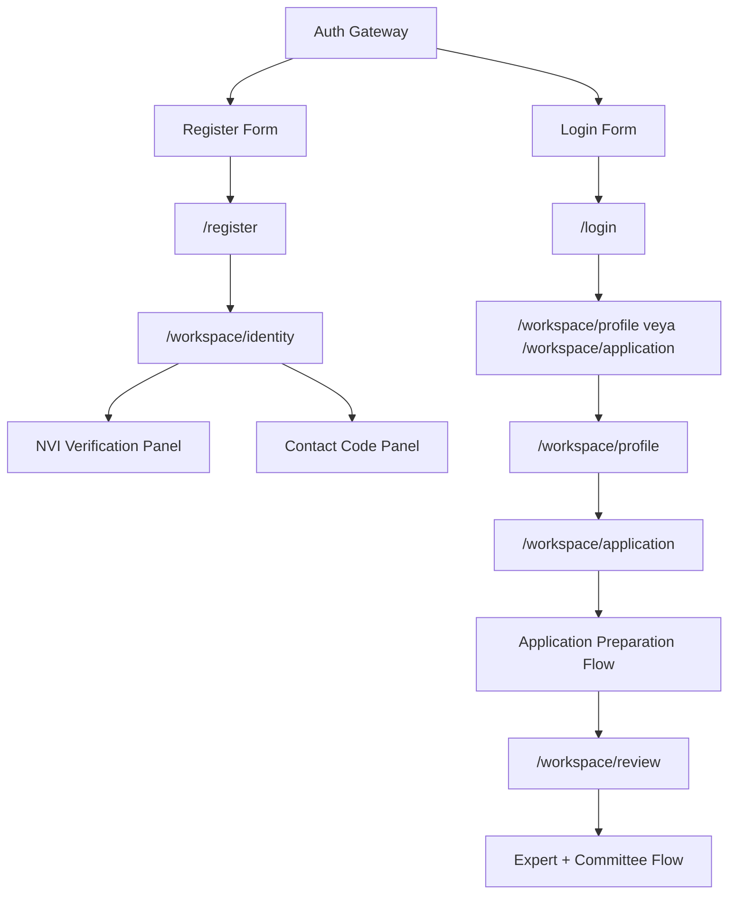

# Site Map

Bu dokuman mevcut React istemcisinin ekran ve panel haritasini tanimlar.

## Genel Harita

## Ekranlar

| Ekran | URL | Gorunurluk | Amac |
| --- | --- | --- | --- |
| Login | `/login` veya `/` | `sessionToken` ve `userId` yoksa | Mevcut hesapla giris |
| Register | `/register` | `sessionToken` ve `userId` yoksa | Yeni arastirmaci kaydi |
| Identity & Verification Workspace | `/workspace/identity` | Kayit sonrasi `userId` varsa | NVI, email ve SMS dogrulama adimlari |
| Profile Workspace | `/workspace/profile` | Hesap aktif veya JWT oturumu varsa | Login, profil tamamlama ve policy probe |
| Application Workspace | `/workspace/application` | JWT ve profil esigi uygunsa | Basvuru hazirlama ve submit demo akisi |
| Review Workspace | `/workspace/review` | Submit edilmis basvuru varsa | Uzman, sekretarya, gundem ve kurul karari akislari |

Not: Uygulama React Router paketi kullanmadan History API ile URL senkronizasyonu yapar. Nginx SPA fallback sayesinde derin linkler Docker ortaminda dogrudan acilir.

## Auth Gateway

| Bolum | Alanlar | Islem |
| --- | --- | --- |
| Giris yap | Email veya telefon, sifre | `POST /auth/login` |
| Kayit ol | Ad, soyad, TCKN, dogum tarihi, email, telefon, sifre | `POST /auth/register` |
| Guven sinyalleri | Kimlik, veri, yetki kutulari | Kullaniciya sistem kurallarini anlatir |

Kayit basarili olunca kullanici ayni sayfada workspace ekranina tasinir ve NVI paneli aktif olur. Login basarili olunca JWT oturumu olusturulur ve authenticated workspace acilir.

## Workspace Layout

| Alan | Aciklama |
| --- | --- |
| Sol durum paneli | Hesap durumu, profil orani, kullanici id, basvuru erisimi, email/SMS/JWT durumlari |
| Son olaylar | UI tarafindaki son 12 islem kaydi |
| Ust aksiyon | Mock mesaj kutularini yenileme |
| Akis navigasyonu | Kimlik, profil, basvuru hazirligi ve inceleme adimlari; kilitli adimlar pasif kalir |
| Ana panel grid | Aktif route'a gore yalnizca ilgili workflow panelleri |

## Panel Haritasi

| Panel | Baslik | Ana Butonlar | Durum Kosulu |
| --- | --- | --- | --- |
| 01 | Kayit formu | Kaydi olustur | `/workspace/identity` |
| 02 | NVI dogrulama | Kimlik dogrulamayi baslat | `pending_identity_check` veya `identity_failed` |
| 03 | Iletisim kodlari | Yeni email kodu, Email kodunu onayla, Yeni SMS kodu, SMS kodunu onayla | `contact_pending` veya `active` |
| 04 | Profil olusturma | Profili olustur, Profili guncelle | `/workspace/profile`; `active` ve JWT oturumu gerekli |
| 05 | Oturum ve profil yetkisi | Login ol, Me bilgisini getir, Policy probe | `/workspace/profile`; korumali butonlar JWT ister |
| 03 | Basvuru hazirligi | Basvurularimi getir, Policy probe, Basvuru demo akisi | `/workspace/application` |
| 04 | Inceleme ve kurul sureci | Basvurularimi getir, Uzman + kurul demo akisi | `/workspace/review` |

## Kullaniciye Gore Beklenen Giris Noktasi

| Kullanici tipi | Baslangic | Sonraki ekran |
| --- | --- | --- |
| Yeni arastirmaci | Auth Gateway > Kayit ol | NVI dogrulama paneli |
| Aktif arastirmaci | Auth Gateway > Giris yap | Profil ve basvuru paneli |
| Sekreterya demo kullanicisi | Dev role provisioning ile olusturulur | UI demo akisi icinde arka planda kullanilir |
| Etik uzman demo kullanicisi | Dev role provisioning ile olusturulur | UI demo akisi icinde arka planda kullanilir |

## UI Durum Kurallari

| Durum | UI etkisi |
| --- | --- |
| `pending_identity_check` | NVI butonu aktif olur |
| `identity_failed` | NVI tekrar denenebilir |
| `contact_pending` | Email/SMS kod panelleri aktif olur |
| `active` | Login ve profil sureci kullanilabilir |
| Profil `< %100` veya profil yok | Basvuru policy probe 403/blocked doner |
| Profil `%100` | Basvuru demo akisi calisabilir |
