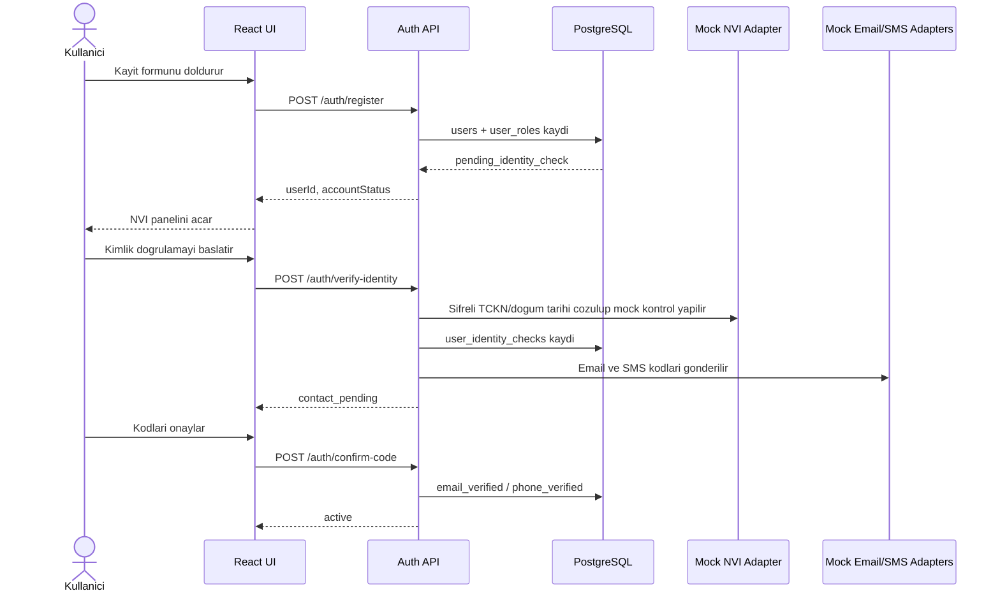
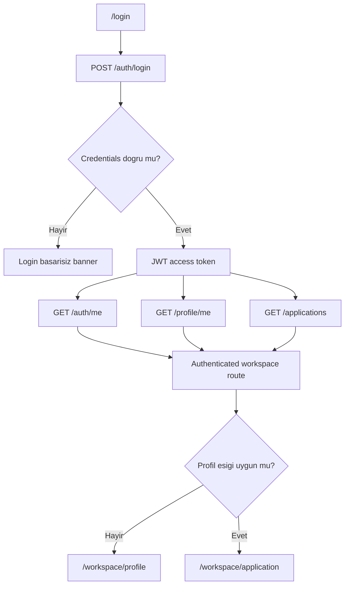
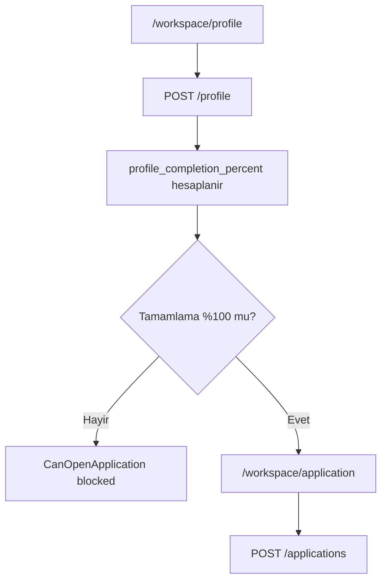
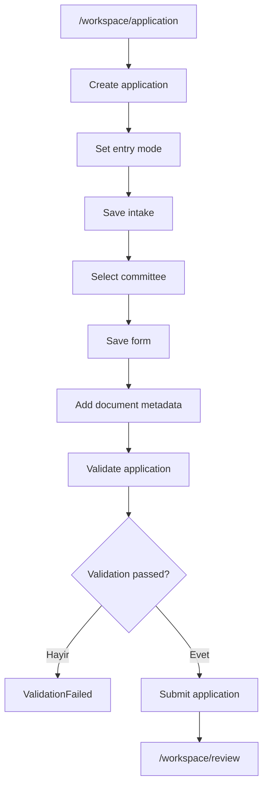
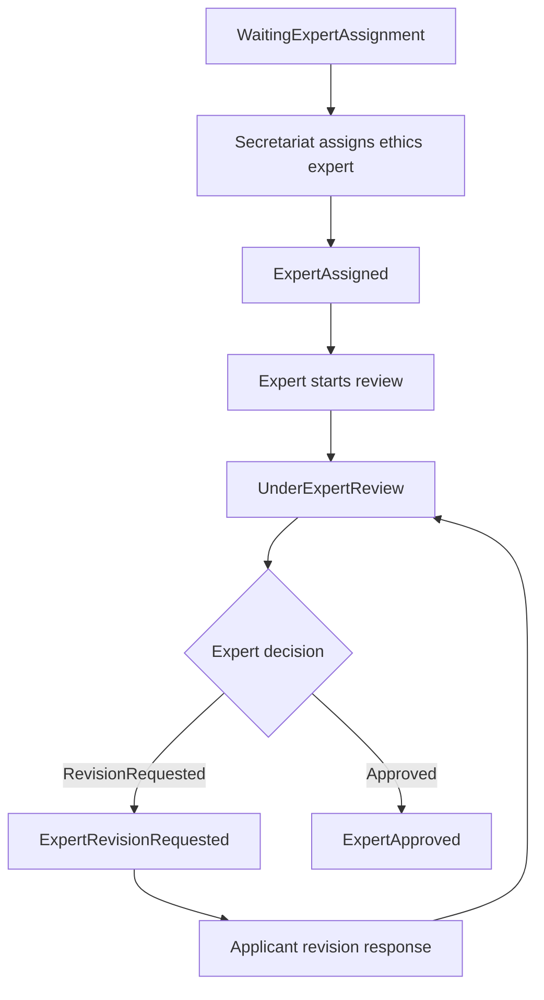
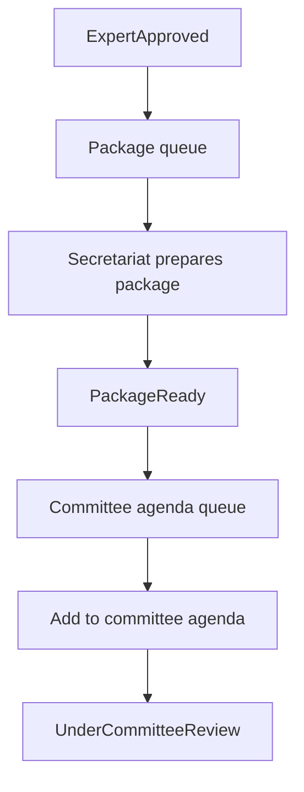
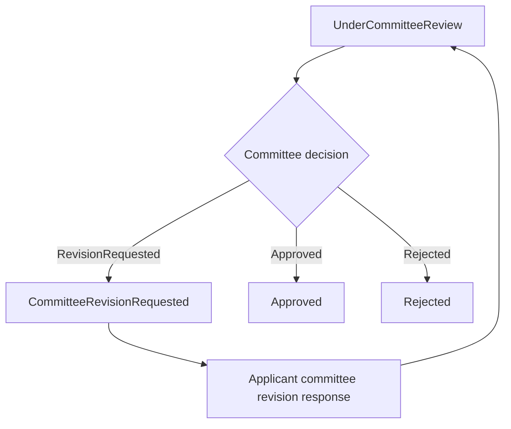

# Workflows

Bu dokuman mevcut uygulamadaki ana is akisi ve durum gecislerini tanimlar.

## 1. Kayit ve Hesap Aktivasyonu

### Hesap durumlari

| Baslangic | Islem | Son durum |
| --- | --- | --- |
| Yok | Register | `pending_identity_check` |
| `pending_identity_check` | NVI basarili | `contact_pending` |
| `pending_identity_check` | NVI basarisiz | `identity_failed` |
| `identity_failed` | NVI tekrar basarili | `contact_pending` |
| `contact_pending` | Email veya SMS kodu dogrulandi | `active` |

Not: Mevcut implementasyonda email veya SMS kanallarindan birinin dogrulanmasi hesabi `active` yapar.

## 2. Login ve Session

## 3. Profil ve Basvuru Yetki Kapisi

### Profil alanlari

| Alan | Not |
| --- | --- |
| Academic title | Opsiyonel fakat completion hesabina girer |
| Degree level | Opsiyonel fakat completion hesabina girer |
| Institution, faculty, department | Kurumsal profil alanlari |
| Position title | Gorev/pozisyon |
| Biography | Metinsel profil bilgisi |
| Specialization summary | Uzmanlik ozeti |
| Has e-signature | E-imza var/yok bilgisi |
| KEP address | KEP adresi |
| CV document id | Nullable Guid, dokuman modulu bu fazda yok |

## 4. Basvuru Hazirlama ve Submit

### Basvuru durum gecisleri

| Islem | Current step |
| --- | --- |
| Create | `Draft` |
| Intake kaydi | `IntakeInProgress` |
| Committee secimi | `CommitteeSelected` |
| Form kaydi | `ApplicationInPreparation` |
| Validation basarili | `ValidationPassed` |
| Submit | `WaitingExpertAssignment` |

## 5. Uzman Inceleme

## 6. Sekreterya Paketleme ve Kurul Gundemi

## 7. Kurul Karari

## 8. Uctan Uca Demo Sirasi

Bu sira UI'daki `Basvuru demo akisi` ve `Uzman + kurul demo akisi` butonlari ile otomatik kosulur.

| Sira | Adim | Beklenen sonuc |
| --- | --- | --- |
| 1 | Register | `pending_identity_check` |
| 2 | Verify identity | `contact_pending` |
| 3 | Confirm email/SMS | `active` |
| 4 | Login | JWT hazir |
| 5 | Profile create/update | `%100` |
| 6 | Policy probe | `ready` |
| 7 | Application create to submit | `WaitingExpertAssignment` |
| 8 | Expert assignment/review/revision/approval | `ExpertApproved` |
| 9 | Package and agenda | `UnderCommitteeReview` |
| 10 | Committee revision/response/approval | `Approved` |

## 9. UI Route Gecisleri

| Kaynak | Tetikleyici | Hedef |
| --- | --- | --- |
| `/login` | Basarili login, profil eksik | `/workspace/profile` |
| `/login` | Basarili login, basvuru erisimi hazir | `/workspace/application` |
| `/register` | Basarili kayit | `/workspace/identity` |
| `/workspace/identity` | Email veya SMS onayi ile hesap aktif | `/workspace/profile` |
| `/workspace/profile` | Profil `%100` | `/workspace/application` |
| `/workspace/application` | Basvuru validation + submit basarili | `/workspace/review` |
| Herhangi workspace | Akisi sifirla | `/login` |
